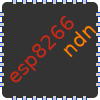

# NDN Arduino library for ESP8266 and more

 

**esp8266ndn** library enables [Named Data Networking](https://named-data.net/) application development in Arduino environment. It supports [ESP8266](https://github.com/esp8266/Arduino), [ESP32, ESP32-S2, ESP32-C3](https://github.com/espressif/arduino-esp32), and [Adafruit nRF52](https://github.com/adafruit/Adafruit_nRF52_Arduino) microcontrollers.

* [Doxygen documentation](https://esp8266ndn.ndn.today/)
* [#esp8266ndn on Twitter](https://twitter.com/hashtag/esp8266ndn) for announcements
* [GitHub Issues](https://github.com/yoursunny/esp8266ndn) for bug reports and best-effort support

## Features

Packet encoding and decoding

* Interest and Data
  * [v0.3](https://docs.named-data.net/NDN-packet-spec/0.3/) format only
  * TLV evolvability: yes
  * forwarding hint: yes, limited to one name
* [NDNLPv2](https://redmine.named-data.net/projects/nfd/wiki/NDNLPv2)
  * fragmentation and reassembly: yes, requires in-order delivery
  * Nack: partial
  * PIT token: yes
  * congestion mark: no
  * link layer reliability: no
* Signed Interest: [v0.3 format](https://docs.named-data.net/NDN-packet-spec/0.3/signed-interest.html)
* Naming Convention: [rev3 format](https://named-data.net/publications/techreports/ndn-tr-22-3-ndn-memo-naming-conventions/)

Transports

* Ethernet: unicast and multicast on ESP8266 and ESP32
* UDP/IPv4: unicast and multicast on ESP8266 and ESP32
* UDP/IPv6: unicast on ESP8266 and ESP32
* [Bluetooth Low Energy](https://github.com/yoursunny/NDNts/tree/main/pkg/web-bluetooth-transport): server/peripheral only on ESP32 and nRF52

KeyChain

* Crypto
  * SHA256: yes (using BearSSL on ESP8266, Mbed TLS on ESP32, Cryptosuite on nRF52)
  * ECDSA: P-256 curve only (using Mbed TLS on ESP32, micro-ecc on ESP8266 and nRF52)
  * HMAC-SHA256: yes (using BearSSL on ESP8266, Mbed TLS on ESP32, Cryptosuite on nRF52)
  * RSA: no
  * Ed25519: no
  * Null: yes
* [NDN certificates](https://docs.named-data.net/NDN-packet-spec/0.3/certificate.html): basic support
* Persistent key and certificate storage: binary files
  * ESP8266: using LittleFS
  * ESP32: using FFat (in Arduino *Tools* menu select "Partition Scheme: with FAT")
  * nRF52: using InternalFileSystem
* Trust schema: no

Application layer services

* [ndnping](https://github.com/named-data/ndn-tools/tree/master/tools/ping) server and client
* segmented object producer and consumer
* [Realtime Data Retrieval (RDR)](https://redmine.named-data.net/projects/ndn-tlv/wiki/RDR) metadata producer and consumer
* [NDNCERT](https://github.com/named-data/ndncert/wiki/NDNCERT-Protocol-0.3) server and client
  * ESP32 only
  * supported challenges: "nop" and "possession"
* [NDN-FCH](https://github.com/11th-ndn-hackathon/ndn-fch) client for connecting to the global NDN testbed and other connected networks
  * ESP8266 and ESP32 only
* [UnixTime](https://github.com/yoursunny/ndn6-tools/blob/main/unix-time-service.md) client for time synchronization

## Installation

1. Clone [NDNph](https://github.com/yoursunny/NDNph) and this repository under `$HOME/Arduino/libraries` directory.
2. Add `#include <esp8266ndn.h>` to your sketch.
3. Check out the [examples](examples/) for how to use.
